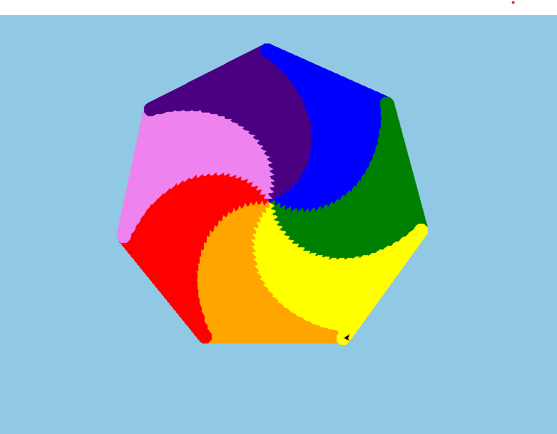

# rainbow
🌈 Rainbow Spiral Pattern using Python Turtle
This project generates a stunning rainbow spiral using Python's built-in turtle graphics module. The spiral is drawn with a colorful blend of the seven rainbow colors and a soft blue background, resulting in an eye-catching geometric design.

🖼️ Output Preview
The spiral expands infinitely, rotating at a 51° angle, while the line width gradually increases. The rainbow color sequence repeats to produce a mesmerizing visual effect on a soft blue canvas.

🐍 Technologies Used
Python (Standard Library)

turtle module for graphics

🧠 Concept
This script demonstrates:

Looping for animation

Color cycling using modulo operator

Dynamic pen width

Turtle direction and speed control

Custom background color

🚀 How to Run
1. Install Python
Ensure you have Python 3 installed. Turtle is included by default.

2. Copy the Code Below into a .py File
import turtle

t = turtle.Turtle()
turtle.bgcolor('#91C8E4')  # Soft blue background

color = ['violet', 'indigo', 'blue', 'green', 'yellow', 'orange', 'red']
t.speed(0)  # Fastest drawing speed

for i in range(55555):
    t.pencolor(color[i % len(color)]) 
    t.width(i / 1000 + 20)            
    t.forward(i)                      
    t.right(51)                      

turtle.done()
3. Run the File
Execute the file using: python filename.py

Output of the code :

🎨 Customization Ideas
Change t.right(51) to other angles for different spiral effects.

Adjust i / 1000 + 20 for thinner or thicker lines.

Use different background colors with turtle.bgcolor().

📁 Project Info
Name	Value
Language	Python
Library	Turtle
Theme	Rainbow Spiral on Blue Sky
Difficulty	Beginner-friendly

📌 Author Notes
This project is great for learning about loops, color manipulation, and creative design in Python. Ideal for beginners looking to explore turtle graphics in a fun and colorful way!

